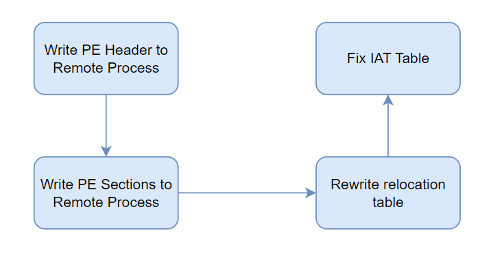

# Inject-Technique
Dự án đưa ra 1 cái nhìn tổng quát về kĩ thuật inject. Các phương pháp inject nhìn chung đều có 2 bước:

+ Ghi mã cần thực thi vào local process hoặc remote process.
+ Thực thi mã đã ghi

Đối với việc ghi mã cần thực thi vào process, có thể sử dụng shellcode hoặc PE file. Ghi shellcode thông qua các WinAPI ghi như WriteProcessMemory khá là đơn giản, tuy nhiên nếu là PE format, điều này sẽ phức tạp hơn. Dự án này sẽ tập trung vào việc xử lý việc ghi PE file vào 1 process.

Thực thi mã đã ghi sẽ là đặc trưng của từng kĩ thuật inject, đơn giản nhất có thể sử dụng CreateRemoteThread, phức tạp hơn sẽ là PoolParty,... Việc này tùy thuộc vào cách attacker lựa chọn và sử dụng.

## Ghi PE File vào Remote Process
Các bước để ghi 1 PE File vào Remote Process như sau:

+ **Rewrite relocation table**

Việc sửa những vị trí trong Relocation table cần được thực hiện nếu như địa chỉ được cấp phát cho PE file (new Imagebase) khác với Imagebase trong PE file.
Trong trường hợp delta Imagebase bằng 0, thì việc sửa đổi là không cần thiết. Đa số trong tất cả các trường hợp thì việc này đều cần thiết.

+ **Fix IAT**

IAT cần sửa trong trường hợp DLL chưa được tải bởi tiến trình gốc. Cần sửa bảng để giải quyết các tham chiếu tới những DLL chưa có sẵn. Trong Process Hollowing, không chứa phần IAT, tuy nhiên nếu như tiến trình đích chưa tải những DLL mà PE inject cần, thì việc inject sẽ thất bại.